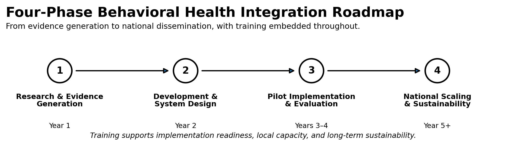
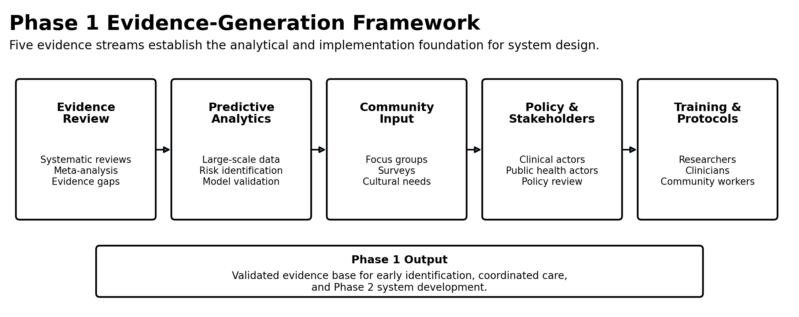
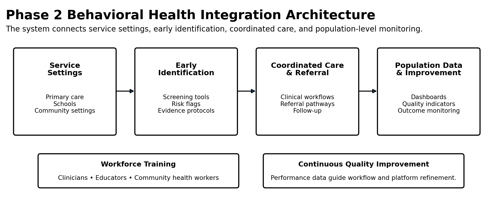
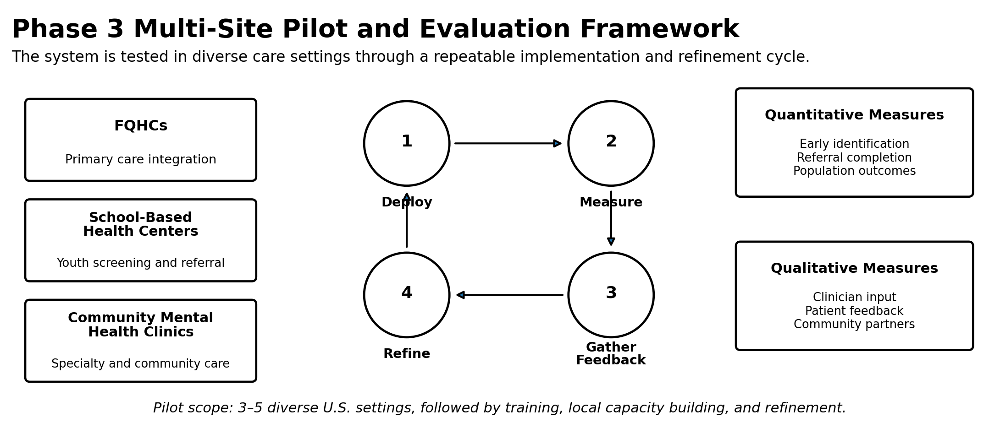

# Behavioral-Health-Integration-Framework

## My Model and Plan for Advancing the Endeavor

My proposed endeavor is a multi-phase initiative designed to develop and implement scalable, evidence-based behavioral health integration and delivery systems that improve early identification, expand access to coordinated care, and strengthen population-level clinical and public health decision-making nationwide. The plan is structured across four phases, including Research, Development, Pilot, and National Scaling, each incorporating training as a core component to ensure sustainability and capacity building.

Figure 1. Four-Phase Behavioral Health Integration Roadmap

## Phase 1: Research & Evidence Generation (Year 1)

This phase focuses on establishing the evidence base for the proposed behavioral health integration systems through rigorous research, data analysis, and stakeholder engagement.

Figure 2. Phase 1 Evidence-Generation Framework

Activities

| Activity | Purpose and Scope |
|---|---|
| Systematic Review & Meta-Analysis | Conduct comprehensive reviews of existing behavioral health integration models, early identification tools, and coordinated care frameworks to identify best practices and evidence gaps. |
| Predictive Modeling & AI Algorithm Development | Design and validate predictive algorithms using large-scale behavioral health datasets to improve early identification of at-risk populations. |
| Community Needs Assessment | Engage underserved communities through focus groups, surveys, and participatory research to identify barriers to care, cultural considerations, and priority needs. |
| Stakeholder Mapping & Policy Analysis | Identify key stakeholders across clinical, public health, and policy sectors; analyze existing policies and reimbursement structures that impact behavioral health integration. |
| Training Component | Develop training curricula for researchers, clinicians, and community health workers on evidence-based early identification protocols and data collection methodologies. |

## Phase 2: Development & System Design (Year 2)

This phase focuses on translating research findings into scalable behavioral health integration systems, including digital tools, clinical workflows, and training programs.

Figure 3. Phase 2 Behavioral Health Integration Architecture

Activities

| Activity | Purpose and Scope |
|---|---|
| Digital Platform Development | Design and build a secure, interoperable digital platform that integrates early identification screening tools, coordinated care referral pathways, and population-level data dashboards. |
| Clinical Workflow Design | Develop evidence-based clinical workflows for primary care, schools, and community settings that embed early identification protocols and coordinated care pathways into existing systems. |
| Quality Improvement Framework | Design a continuous quality improvement framework with measurable indicators for early identification rates, care coordination effectiveness, and population-level outcomes. |
| Training Component | Develop and deliver training programs for clinicians, educators, and community health workers on using the digital platform, implementing clinical workflows, and applying evidence-based early identification and referral protocols. |

## Phase 3: Pilot Implementation & Evaluation (Years 3–4)

This phase focuses on real-world testing, refinement, and evaluation of the behavioral health integration systems in diverse U.S. settings.

Figure 4. Phase 3 Multi-Site Pilot and Evaluation Framework

Activities

| Activity | Purpose and Scope |
|---|---|
| Multi-Site Pilot Implementation | Deploy the digital platform and clinical workflows in 3–5 diverse U.S. settings, including Federally Qualified Health Centers (FQHCs), school-based health centers, and community mental health clinics. |
| Mixed-Methods Evaluation | Conduct rigorous evaluation using quantitative metrics (early identification rates, referral completion, population-level outcomes) and qualitative feedback from clinicians, patients, and community partners. |
| Iterative Refinement | Use evaluation data to refine the digital platform, clinical workflows, and training programs based on real-world implementation challenges and user feedback. |
| Training Component | Train implementation teams, clinicians, and community partners on the refined systems; conduct train-the-trainer programs to build local capacity for sustained implementation. |

## Phase 4: National Scaling & Sustainability (Year 5 and Beyond)

This phase focuses on scaling the behavioral health integration systems nationwide, ensuring sustainability through policy engagement, partnerships, and continuous innovation.

Figure 5. Phase 4 National Scaling and Sustainability Ecosystem

[Figure 5. Phase 4 National Scaling and Sustainability Ecosystem](figure5.png)

Activities

| Activity | Purpose and Scope |
|---|---|
| National Dissemination | Scale the digital platform and clinical workflows to additional U.S. settings, including rural health clinics, tribal health systems, and large health systems. |
| Policy Engagement | Engage with U.S. policymakers, health systems, and payers to support reimbursement structures and policy frameworks that incentivize behavioral health integration and coordinated care. |
| Sustainability Planning | Develop a sustainability plan that includes public-private partnerships, revenue models, and ongoing quality improvement infrastructure. |
| Training Component | Develop continuing education programs and online learning modules to ensure sustained capacity building. |

    
